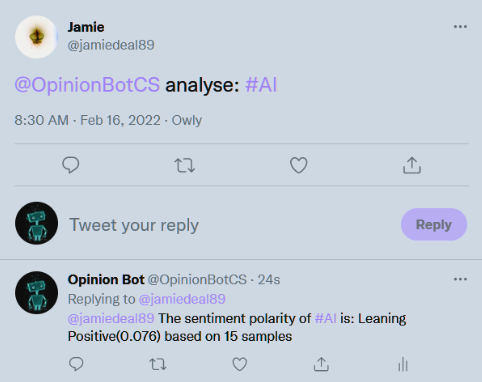

# Twitter-API-Bot
A Twitter Bot which uses Tweepy and TextBlob modules to automatically reply to users based on the sentiment of their tweets or analyse given hashtags for an average sentiment. Also implements GPT-Neo to respond to tweets in a unique way.

## Requirements:
 - torch
 - transformers
 - tweepy
 - textblob

## The page on twitter (currently offline)

## An example of it being used for sentiment

## An example of it being used for AI

